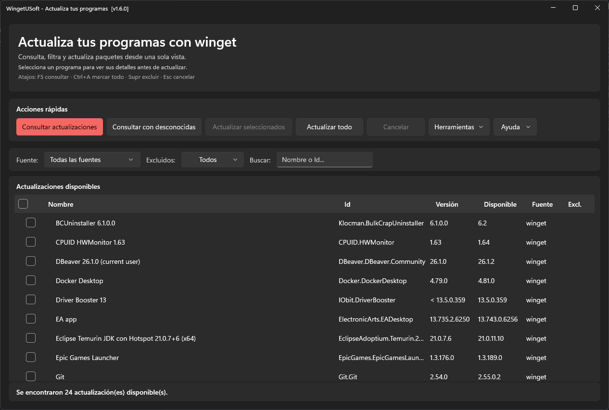
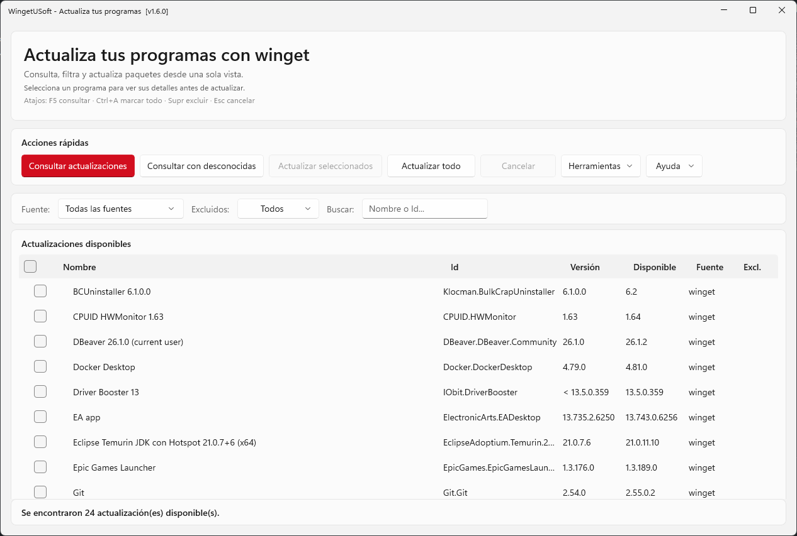
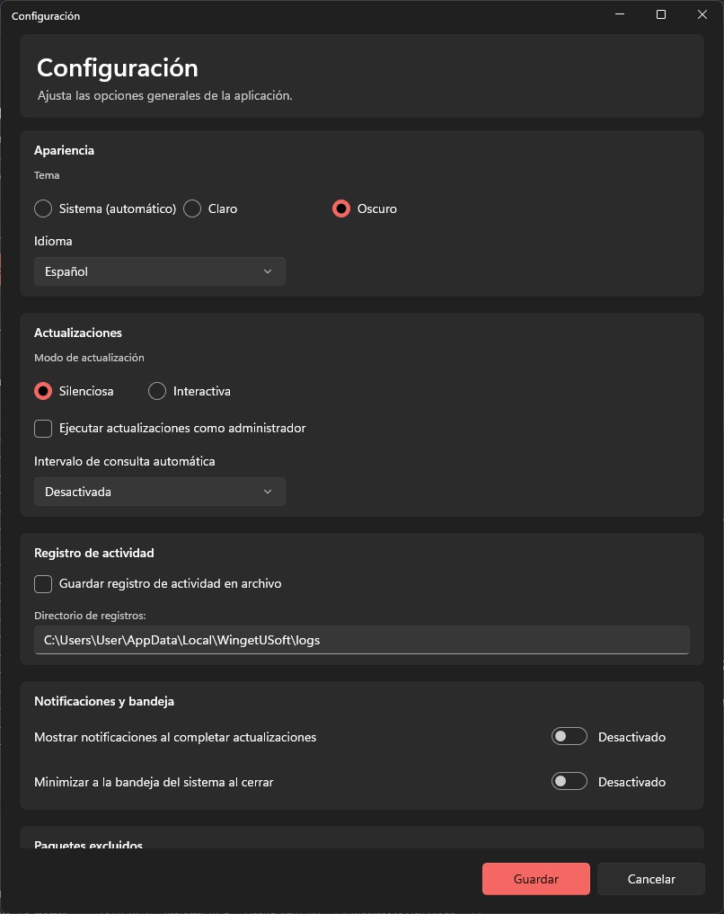

# WingetUSoft


Interfaz gráfica (WinUI 3) para gestionar **actualizaciones y desinstalaciones de software** mediante
**winget** en Windows. Consulta qué programas tienen versión nueva, actualiza los que elijas (uno, varios
o todos), desinstala lo que ya no usas y exporta la lista — todo desde una sola ventana, sin tocar la
línea de comandos.



<details>
<summary>Más capturas (tema claro y Configuración)</summary>





</details>

## Instalación

Descarga el instalador más reciente desde la página de **[Releases](https://github.com/xfiberex/WingetUSoft/releases)**
(`WingetUSoft-x.y.z-setup.exe`) y ejecútalo.

El instalador comprueba las dependencias y **descarga solo lo que falte** en tu equipo (VC++ Redist y
.NET 10 Desktop Runtime); en un Windows al día no descarga nada. La app se instala **sin privilegios de
administrador para su uso normal**: eleva puntualmente, y solo si lo pides, para las actualizaciones que
lo necesiten.

> **SmartScreen:** el instalador **no está firmado** todavía (no hay certificado de código), así que
> Windows puede mostrar "editor desconocido". Puedes verificar la descarga con el archivo `.sha256` que
> acompaña a cada release.

## Actualizaciones de la propia app

WingetUSoft comprueba si hay una versión más reciente en GitHub Releases **al iniciarse** y bajo demanda
desde *Ayuda → Buscar actualización*. El aviso muestra el **changelog** de la nueva versión antes de
descargar e instalar, y tras actualizar aparece una sola vez el diálogo de **Novedades**.

> **Modelo de confianza:** la descarga va por **HTTPS** desde GitHub Releases y, antes de ejecutar nada,
> el instalador **se verifica**: primero por **firma Authenticode** si la tiene y, si no, contra el
> **hash SHA-256** publicado como asset del release (`...exe.sha256`). Si no cuadra ninguna de las dos,
> el archivo se borra y la actualización se aborta. **Alcance honesto:** el hash y el `.exe` salen del
> mismo release, así que esto detecta manipulación o corrupción en tránsito, pero no protegería frente
> a un compromiso de la cuenta de GitHub del proyecto — para eso hace falta la firma Authenticode.

## Características

### Actualizaciones
- **Consulta de actualizaciones** — lista todos los paquetes con versión disponible, con soporte para versiones desconocidas (`<`).
- **Actualización selectiva** — marca los paquetes con su casilla (o todos de golpe con la casilla de la cabecera / `Ctrl+A`) y actualízalos. El botón muestra cuántos hay marcados y se deshabilita si no hay ninguno. La selección **sobrevive a buscar, ordenar y filtrar**.
- **Modo silencioso / interactivo** — compatible con las flags `--silent` e `--interactive` de winget.
- **Elevación de permisos** — ejecuta lotes elevados mediante un worker interno con comunicación por named pipe, sin scripts temporales en disco. Incluye reporte de progreso de descarga en tiempo real durante la instalación elevada.
- **Progreso siempre visible** — la barra de estado está anclada al pie de la ventana (fuera de la página desplazable) e incluye una barra de progreso que avanza también *dentro* de cada paquete, según lo descargado.
- **Resumen único de fallos** — si varios paquetes fallan, se informa en un solo diálogo al terminar el lote, en vez de interrumpirlo con un modal por cada fallo.

### Exploración y filtrado
- **Búsqueda en tiempo real** — filtra la lista de paquetes por nombre o ID mientras escribes.
- **Columnas ordenables** — ordena por nombre, ID, versión instalada, versión disponible o fuente haciendo clic en el encabezado. Las versiones se ordenan **numéricamente** (`1.9.0` antes que `1.10.0`), no como texto.
- **Estados de la tabla** — la tabla dice siempre en qué punto está: consultando, sin datos todavía, todo al día, sin coincidencias con los filtros, o consulta cancelada/fallida.
- **Panel de información** — al seleccionar un paquete muestra su descripción, un enlace a la página oficial y otro a las notas de versión. Funciona **en cualquier idioma de Windows** (winget traduce las etiquetas de su salida).
- **Ver en winget.run** — abre la página del paquete en [winget.run](https://winget.run) desde el menú contextual.

### Desinstalación
- **Ventana de desinstalación** — lista todos los programas instalados con búsqueda y filtrado, y permite desinstalar cualquier paquete con confirmación previa.

### Gestión y configuración
Todas las preferencias viven en un solo sitio, la ventana **Configuración**; el menú **Herramientas**
solo tiene acciones (exportar, historial, desinstalar).

- **Lista de exclusiones** — excluye paquetes permanentemente de las actualizaciones automáticas.
- **Historial** — registra cada actualización con fecha, versiones y resultado (máx. 500 entradas), con búsqueda, filtros y exportación a CSV.
- **Exportación** — exporta la lista a CSV o TSV con neutralización de fórmulas (seguro para Excel/Calc).
- **Tema claro / oscuro** — integrado con el sistema de temas de Windows y configurable manualmente.
- **Idioma** — español, inglés, portugués, francés e italiano, aplicados en caliente.
- **Modo de actualización** — silenciosa o interactiva, y opción de ejecutar como administrador.
- **Auto-comprobación** — comprueba actualizaciones de forma periódica configurable (30 / 60 / 120 min).
- **Aviso al terminar** — sonido + parpadeo de la barra de tareas al acabar un lote largo, y progreso en el icono de la barra de tareas.
- **Log de archivo** — logging opcional por día en `%LocalAppData%\WingetUSoft\logs\`.

### Accesibilidad
- **Manejable solo con teclado** — incluidas las cabeceras de la tabla, que son botones enfocables y
  anuncian por qué columna y en qué dirección está ordenada.
- **Contraste verificado** — los colores del registro de actividad cumplen WCAG AA (4.5:1) en tema
  claro y oscuro, comprobado por tests.

> 📋 Consulta la **[hoja de ruta](ROADMAP.md)** para ver las características implementadas y las próximas
> (organizadas por *tiers*).

## Requisitos

| Componente | Versión mínima |
|---|---|
| Windows | 10 (build 19041) o superior |
| .NET | 10 — *solo para compilar desde código; el instalador lo descarga si falta* |
| Windows App SDK | 1.8 — *viaja dentro de la app, no hay que instalarlo* |
| winget (App Installer) | Cualquier versión reciente desde Microsoft Store |

## Compilar desde el código

```bash
# Compilar
dotnet build WingetUSoft.slnx

# Ejecutar
dotnet run --project src/WingetUSoft/WingetUSoft.csproj

# Ejecutar tests unitarios (xUnit)
dotnet test tests/WingetUSoft.Tests/WingetUSoft.Tests.csproj

# Ejecutar tests de UI (FlaUI — lanzan la app real; requieren sesión de escritorio
# interactiva, pero NO elevación: la app corre asInvoker)
dotnet test tests/WingetUSoft.UiTests/WingetUSoft.UiTests.csproj
```

### Generar el instalador

Requiere [Inno Setup 6](https://jrsoftware.org/isinfo.php) (`winget install JRSoftware.InnoSetup`):

```powershell
src\WingetUSoft\installer\build-installer.ps1
```

Publica la app (framework-dependent, win-x64), compila el instalador en `installer\Output\` y genera su
`.sha256`. Con certificado, `-CertThumbprint <huella>` (o `-CertFile` / `-CertPassword`) firma además el
ejecutable y el instalador; el `.sha256` se calcula **después** de firmar.

### Publicar una versión

`release.ps1` (raíz del repo) corta una versión completa en un paso: valida, ejecuta las pruebas
(**unitarias y de UI**: un release no sale si la app real no pasa), actualiza `<Version>`, compila el
instalador, hace commit + tag, lo sube y crea el **GitHub Release** con el instalador y su `.sha256`.

```powershell
.\release.ps1 -Version 1.7.0           # release completo
.\release.ps1 -Version 1.7.0 -DryRun   # muestra el plan sin modificar nada
```

Flags: `-DryRun`, `-SkipTests`, `-SkipUiTests` (para sesiones sin escritorio interactivo), `-AllowDirty`,
`-NotesFile <archivo.md>` y los de firma.

### Regenerar las capturas del README

```powershell
.\tools\capture-screenshots.ps1                    # tema claro y oscuro
.\tools\capture-screenshots.ps1 -Theme dark -Language en
```

Lanza la app real, la conduce por UI Automation (consulta winget, abre Configuración) y guarda los PNG en
`docs/screenshots/`. Respalda y restaura tu `settings.json` real, así que no altera tu instalación.

## Estructura del proyecto

```
WingetUSoft/
├── src/WingetUSoft/             # Proyecto de aplicación (WinUI 3)
│   ├── Program.cs              # Entry point
│   │
│   ├── Core/                   # Lógica de negocio pura (sin UI ni efectos externos)
│   │   ├── ReleaseNotes.cs        # Notas de versión (Markdown → texto plano)
│   │   ├── Throughput.cs          # ETA de descargas/operaciones largas
│   │   ├── VersionOrder.cs        # Orden semántico de versiones (1.9 < 1.10, "< x", "Unknown")
│   │   ├── LogPalette.cs          # Colores del registro por tema (contraste WCAG AA verificado)
│   │   ├── WindowSizing.cs        # Dimensionado/centrado por DPI (puro, testeable)
│   │   ├── LegalText.cs           # Licencia MIT y avisos de terceros embebidos en el .exe
│   │   ├── DelimitedTextExporter.cs # Exportación CSV/TSV segura
│   │   └── Models/                # WingetPackage, WingetPackageInfo, WingetProgressInfo, ...
│   │
│   ├── Services/               # Operaciones con efectos externos (procesos, red, disco)
│   │   ├── WingetService.cs       # Ejecución de winget, parsing, elevación
│   │   ├── WingetShowLabels.cs    # Etiquetas de `winget show` en los 10 idiomas que winget traduce
│   │   ├── GitHubUpdateService.cs # Auto-actualización (verificación Authenticode / SHA-256)
│   │   └── CleanupScanner.cs      # Detección de residuos post-desinstalación
│   │
│   ├── Settings/               # Persistencia y configuración (AppSettings, HistoryEntry, HistoryFilter)
│   ├── Localization/           # Cadenas ES/EN/PT/FR/IT (patrón L.T("clave"))
│   │
│   ├── UI/                     # Capa de presentación (WinUI 3)
│   │   ├── MainWindow.xaml/.cs      # Ventana principal (actualizaciones)
│   │   ├── SettingsWindow.xaml/.cs  # Configuración (único hogar de las preferencias)
│   │   ├── HistoryWindow.xaml/.cs   # Historial con filtros y exportación
│   │   ├── UninstallWindow.xaml/.cs # Desinstalación
│   │   ├── CleanupWindow.xaml/.cs   # Limpieza de residuos
│   │   ├── AboutDialog.xaml/.cs     # Acerca de
│   │   ├── LegalTextDialog.xaml/.cs # Licencia / Avisos de terceros
│   │   ├── WhatsNewDialog.xaml/.cs  # Novedades de la versión
│   │   └── WrapPanel.cs, WindowSizer.cs, Converters.cs, ...
│   │
│   └── installer/             # Inno Setup (installer.iss) + build-installer.ps1
│
├── tests/WingetUSoft.Tests/    # Tests unitarios (xUnit)
├── tests/WingetUSoft.UiTests/  # Tests de UI end-to-end (FlaUI + UIA3, xUnit)
├── tools/                      # capture-screenshots.ps1 (capturas del README)
└── docs/screenshots/           # Capturas usadas en este README
```

## Datos de usuario

| Artefacto | Ruta |
|---|---|
| Configuración | `%LocalAppData%\WingetUSoft\settings.json` |
| Logs diarios | `%LocalAppData%\WingetUSoft\logs\YYYY-MM-DD.log` |

Si `settings.json` se corrompe, se crea una copia de seguridad automática con timestamp y se restauran
los valores por defecto.

## Licencia

Software libre distribuido bajo la **[MIT License](LICENSE)**: puedes usarlo, modificarlo y
redistribuirlo libremente, incluso en proyectos privativos, conservando el aviso de copyright.
Se ofrece **SIN NINGUNA GARANTÍA**.

Las atribuciones de componentes de terceros están en
[THIRD-PARTY-NOTICES.txt](THIRD-PARTY-NOTICES.txt). Ambos textos se pueden consultar **dentro de la app**
en *Ayuda → Licencia* y *Ayuda → Avisos de terceros*.

## Privacidad

La aplicación **no recopila datos personales ni telemetría**. Se conecta a Internet únicamente
para consultar/instalar paquetes vía winget y para comprobar actualizaciones de la propia app en
GitHub Releases (HTTPS).
